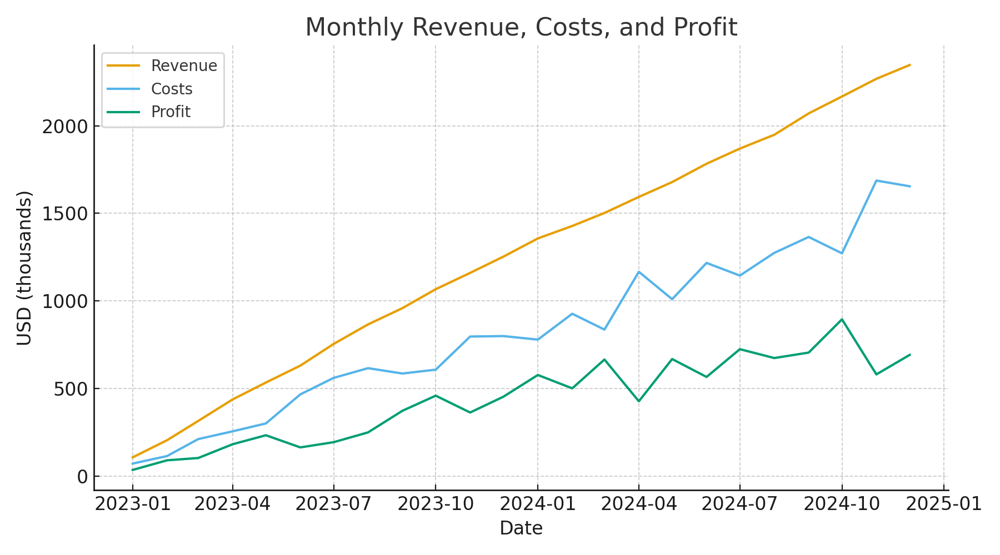
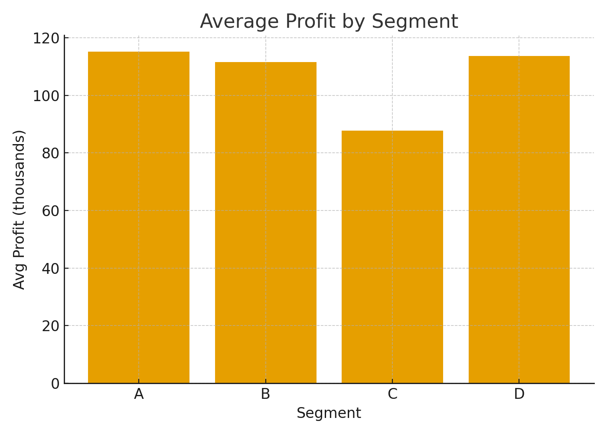
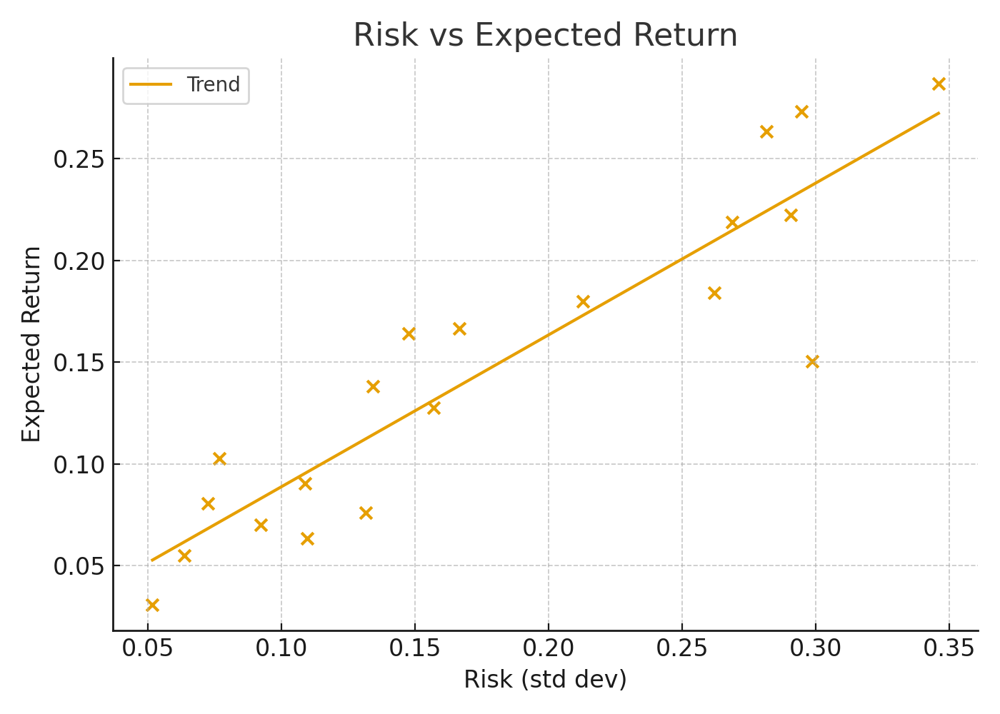
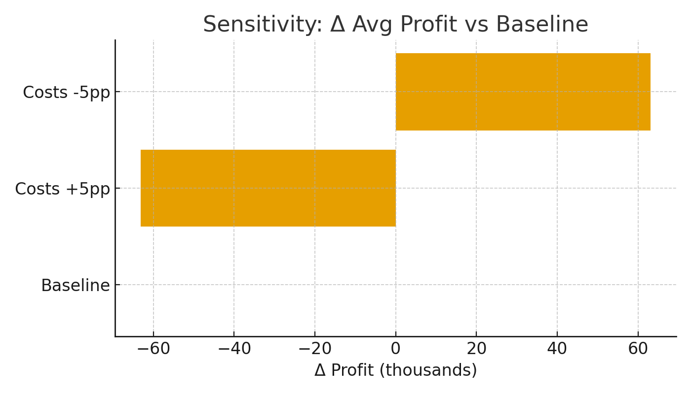

# Executive Summary
- Revenue and profit trend upward over the last 24 months; costs remain stable as a fraction of revenue.
- Segments B and C drive outsized average profit; Segment D underperforms and merits review.
- Profit is sensitive to cost ratio assumptions: a ±5 percentage point change shifts average profit by thousands, changing prioritization of cost controls.

# Key Visuals & Interpretation
**1) Time Series — Revenue, Costs, Profit**

*What it shows:* A rolling 24-month view of revenue, costs, and profit.  
*Key insight:* Profit grows as revenue outpaces costs.  
*Assumptions/limits:* Synthetic data for structure; scale illustrative.

**2) Bar — Average Profit by Segment**

*What it shows:* Mean profit across four segments.  
*Key insight:* Segments B and C contribute the most profit; Segment D lags.  
*Assumptions/limits:* Segment definitions stable; mix effects not decomposed.

**3) Scatter — Risk vs Expected Return**

*What it shows:* Relationship between risk (volatility proxy) and expected return.  
*Key insight:* Positive slope suggests higher return opportunities accompany higher risk.  
*Assumptions/limits:* Linear trend is a simplification; tail risks not modeled.

# Assumptions & Risks
- **Cost ratio stability:** Costs assumed to scale with revenue; large supply shocks or wage spikes would break this.  
- **Segment mix:** Segment-level averages assume consistent definitions and comparable accounting.  
- **Risk estimation:** Uses a simple volatility proxy and linear fit; non-linearities and regime shifts may exist.

# Sensitivity Summary
We changed the average cost ratio by ±5 percentage points.

| Scenario      | Avg Profit | Δ vs Baseline |
|---------------|-----------:|--------------:|
| Baseline      | 447.00 | 0.00 |
| Costs +5pp    | 383.86 | -63.14 |
| Costs -5pp    | 510.14 | 63.14 |

*Interpretation:* Profit is meaningfully impacted by cost ratio shifts. Tight cost control (procurement, labor efficiency) has first-order effects.

# Decision Implications — “What this means for you”
- **Prioritize Segments B/C** for growth initiatives; **diagnose Segment D** (pricing, churn, cost-to-serve).  
- **Hedge cost inflation**: negotiate supplier terms, automate labor-intensive workflows.  
- **Risk budgeting:** In risk-seeking portfolios, accept higher volatility only with commensurate expected return.

---
*Reproducibility:* Figures live in `deliverables/images/` and can be regenerated via `notebooks/stage12_demo.ipynb`.
